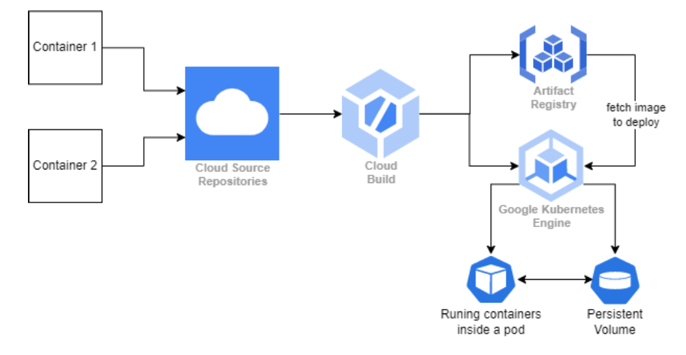

# K8s Microservices

Two microservices deployed on Google Kubernetes Engine (GKE) Cluster.

## Technologies Used

- Microservices: `Node.js`
- Container Registery: `GCP Artifact Registry`
- CI/CD: `GCP Cloud Build`
- Infrastructure-as-Code (IaC): `Terraform`
- Containerization: `Docker`
- Cluster: `Google Kubernetes Engine (GKE)`

## Architecture

